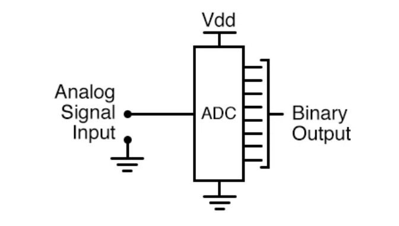
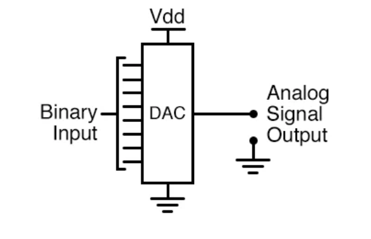
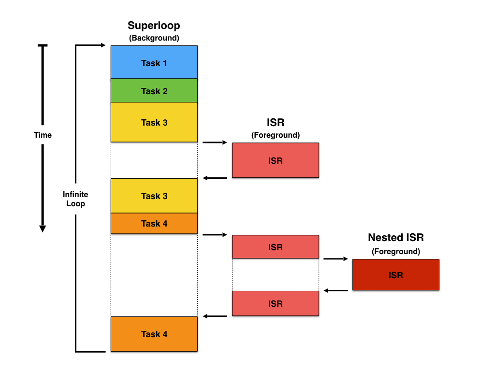
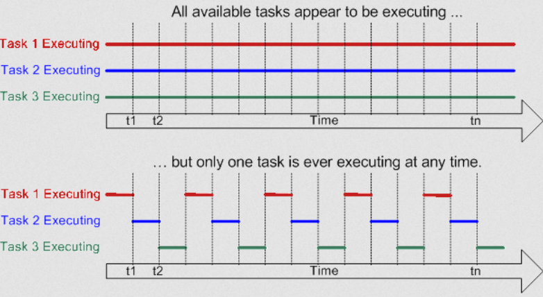
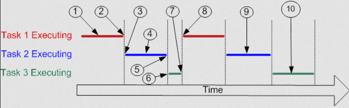
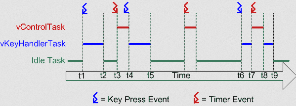
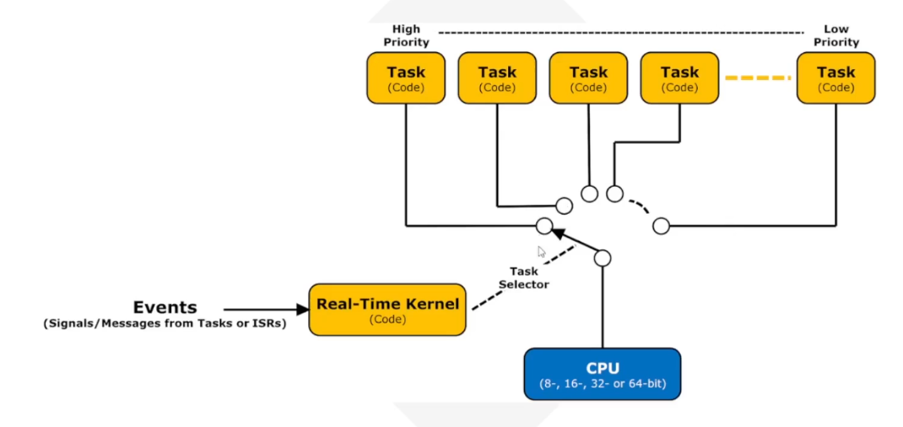
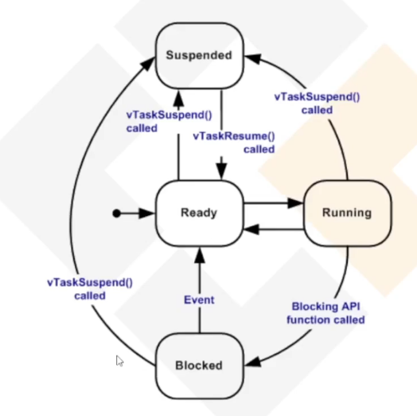
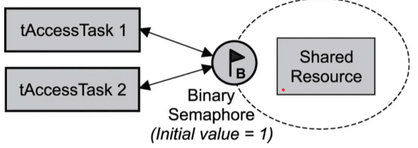
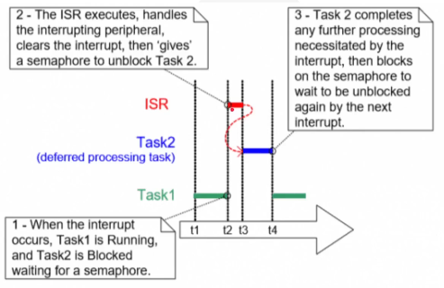

# Professional ESP32 Academy

## Introduction

- The ESP32 is a family of **SoC** _(System on a chip)_ developed by Espressif Systems.
A SoC is defined as an integrated circuit that combines multiple cores, such as CPUs, GPUs,
and other functional units, along with memory, I/O ports, and sometimes modems on a single
substrate. This integration has the goal of enhancing performance, reducing power consumption,
and optimizing semiconductor die area compared to traditional motherboard-based architectures.

- 32-bit Architectures: _Xtensa LX6, Xtensa 32-bit LX7, and RISC-V 32-bit_.
- Connectivity: _Wi-Fi, Bluetooth Classic/Low-Energy (LE)/Mesh, IEEE 802.15.4 (Thread, Matter,
and Zigbee)_.

> **IMPORTANT:** _the materials in this file that contain SoC-specific details will do so according to the ESP32-C6 SoC. For other SoCs/modules, check their respective documentations as described below._

- **IMPORTANT: ALL PROJECTS MUST HAVE THE FOLLOWING '.clangd' FILE AT ROOT**

```bash
CompileFlags:
    Remove: [-f*, -m*]
```

## Documentations

1. [ESP-IDF](https://developer.espressif.com/tags/esp-idf/)
2. [SoCs](https://www.espressif.com/en/products/socs) - Use to look for:
   - Technical Reference Manuals
   - Datasheets
   - Hardware Design Guidelines
3. Other worthwhile readings:
   - [ESP-IDF SDK](https://www.espressif.com/en/products/sdks/esp-idf)
   - [Espressif's Blog](https://developer.espressif.com/blog/)
   - [ESP32 Forums](https://esp32.com/)

## ESP-IDF Basics

- Activate env:

```bash
get_idf
```

1. Main CLI Commands

```bash
idf.py create-project <project_name> # generates a basic initial structure in the project_name directory

idf.py set-target <target> # defines the target MCU for which the project will be compiled for
  
idf.py menuconfig # opens an interactive config UI for adjusting compile options and others for the project

idf.py clean # removes the files generated during the previous compilation, project ready for a new build

idf.py fullclean # removes all generated files, including local project configs, directory returns to initial state

idf.py build # compiles the project and generates the binaries (into build/) that will be loaded into the device

idf.py flash # flashed the complete binary to the ESP (will compile the project if needed, then upload to the connected board)
idf.py -p PORT flash # specifies the serial port to flash the binary
idf.py app-flash # uploads only the application's binary, without flashing other memory segments, e.g., the bootloader
idf.py encrypted-flash # flashes the firmware cryptographed, if cryptography is enabled in the project

idf.py monitor # connects to the ESP serial port and shows the debugging logs in real-time

idf.py erase_flash # removes completely the flash memory of the ESP device, useful to clean all data
```

1. Additional Useful Commands

```bash
idf.py size # shows the flash memory usage of the compiled application, including binary sizes and partitions sizes

idf.py size-components # shows a detailed table with memory usage per component

idf.py reconfigure # generates the configurations of the project again without recompiling

idf.py bootloader # compiles only the project's bootloader

idf.py gdb # initializes GDB for project-debugging

idf.py gdbgui # initializes a GUI for debugging with GDB

idf.py -C components create-component <my_component> # creates a new component inside an existing ESP-IDF project, creating the basic components/my_component structure
```

1. Logging

- ESP-IDF provides a set of macros for logging messages throughout the program's execution, through the header file `"esp_log.h"`.

- 5 levels of logging are defined. Below they are listed, in order of increasing verbosity:
  1. ESP_LOGE - Error
  2. ESP_LOGW - Warning
  3. ESP_LOGI - Info
  4. ESP_LOGD - Debug
  5. ESP_LOGV - Verbose
  
> In each C file that needs logging functionalities, define the **TAG** variable as:

```c
static const char TAG[] = "MyModule";
```

> Then use one of logging macros to produce output, e.g.:

```c
ESP_LOGW(TAG, "Baud rate error %.1f%%. Requested: %d baud, actual: %d baud", error * 100, baud_req, baud_real);

ESP_EARLY_LOGW(TAG, "Early log message %d", i++);

ESP_DRAM_LOGE(DRAM_STR("TAG_IN_DRAM"), "DRAM log message %d", i++);
```

> Result:

```bash
I (112500) MyModule: Baud rate error 1.5%. Requested: 115200 baud, actual: 116928 baud
W (112500) MyModule: Early log message 1
E : TAG_IN_DRAM: DRAM log message 2
```

- Enabling higher verbosity logging levels will automatically enable the lower levels. E.g.:

```c
esp_log_level_set(TAG_ ESP_LOG_INFO); // Enables LOGI, but also LOGW and LOGE since they are below INFO in the verbosity levels
```

- Disable all logs:

```c
esp_log_level_set(TAG, ESP_LOG_NONE);
```

## General Purpose Input Output - GPIO in Microcontrollers

- Allows direct, software-controlled, interaction with external devices. GPIO pins can be configured as input to read signals from sensors, buttons, or other peripherals, or as output to control components like LEDs, motors, and displays. Provides a more flexible and simple way to interface with hardware.

- Each GPIO pin can be configured in one of the following modes:
  1. Input Mode: the pin reads signals from external devices, such as sensors or push buttons. The voltage level (high or low) is interpreted as a binary signal (1 or 0).
  2. Output Mode: the pin sends signals to control devices like LEDs, buzzers, or relays. The microcontroller sets the voltage level (high or low) to activate or deactivate the device.

- To ensure a stable signal when a GPIO pin is set as an input but is not actively driven by an external circuit, pull-up and pull-down resistors are used:
  1. Pull-up resistor: keeps the pin at a HIGH state when no signal is applied.
  2. Pull-down resistor: keeps the pin at a LOW state when no signal is applied.

> Pull-up and pull-down resistors are used to correctly bias the inputs of digital gates.
> These resistors prevent floating states when there is no input condition, which can cause unpredictable behavior in digital circuits. Therefore, if the microcontroller don't utilize them through the GPIO pins, and nothing is connected to the pins, the program will read a "floating" impedance state.

> A pull-up resistor is used to establish an additional loop over the critical components while making sure that the voltage is well-defined even when the switch is open. It is used to ensure that a wire is pulled to a high logical level in the absence of an input signal. It is not a special kind of resistor. They are simple fixed-value resistors connected between the coltage supply and the appropriate pin that defines the input or output voltage in the absence of a driving signal.
> When the switch is open, the voltage of the gate input is pulled up to the level of the input voltage.
> When the switch is closed, the input voltage at the gate goes directly to the ground.
> You need to use a pull-up resistor when you have a low default impedance state and wish to pull the signal to `high`.

(TODO) PUT FIGURE HERE

> In the figure above, a pull-up resistor with a fixed value is used to connect the voltage supply and a particular pin in the digital logic circuit. The pull-up resistor is paired with a switch to ensure that the voltage between GND and VCC is actively controlled when the switch is open. At the same time, it will not affect the state of the circuit. If we do not use a pull-up resistor, it will result in a short circuit. This is because the pin cannot be directly shorted to the ground or VCC as this will eventually damage the circuit. Following Ohm's Law principle, if the is a pull-up resistance, a small amount of current will flow from the source to the resistors and to the switch before reaching the ground.

> A pull-down resistor is used to ensure that inputs to logic systems settle at expected logic levels whenever external devices are disconnected or of high impedance. It ensures that the wire is at a defined low logic level even when there are no active connections with other devices. The pull-down resistor holds the logic signal near to zero volts (0V) when no other active device is connected. It pulls the input voltage down to the ground to prevent an undefined state at the input. It should have a larger resistance than the impedance of the logic circuit. Otherwise, it will make the input voltage at the pin on constant logical low value no matter the position of the switch. When the switch is open, the voltage of the gate input is pulled down to the level of the ground. When the switch is closed, the input voltage at the gate goes to Vin. Without the resistor, the voltage leves would virtually float between the two voltages.

(TODO) PUT FIGURE HERE

> In the figure above, the pull-down resistors in the circuit also ensure that the voltage between VCC and a microcontroller pin is actively controlled when the switch is open. Unlike the pull-up resistor, the pull-down resistor pulls the pin to a low value instead of high value. The pull-down resistor which is connected to the ground or 0V sets the digital logic level pin to default or 0 until the switch is pressed and the logical level pin becomes high. Therefore, the small amount of current flows from the 5V source to the ground using the closed switch and pull-down resistor preventing the logic level pin from getting shorted with the 5V source.

---

#### Aside: Ideal Resistance Values for Pull-up and Pull-down Resistors

- When the button is pressed, the input pin is pulled down. The value of the resistor near the supply controls how much current you want to flow from VCC through the button, and then to ground. High current will flow through the pull-up resistor if the resistance value is too low. It may cause unnecessary usage of power even when the switchis closed since the device will heat up. This condition is called a **strong pull-up** and should always be avoided when low power consumption is a requirement.

- When the button is not pressed, the input pint is pulled high. The value of the pull-up resistor controls the voltage on the input pin. When the switch is open and a high pull-up resistance value is combined with a large leakage current from the input pin, the input voltage can become insufficient. This is called having a **weak pull-up**. The pull-up resistor's actual value depends on the impedance of the input pin that is closely related to the pin's leakage current.

> Based on the two conditions above, for **pull-up resistors**, you need to use a resistor that is at least 10 times smaller than the value of the input pin impedance. For logic devices that operate at 5V, the typical pull-up resistor value should be between 1-5 kΩ. On the other hand, for switch and resistive sensor applications, the typical pull-up resistor value should be between 1-10 kΩ.

> For **pull-down resistors**, it should always have a larger resistance than the impedance of the logic circuit. Or else, it will pull the voltage down by too much and the input voltage at the pin would remain at a constant logical low value regardless of whether the switch is on or off.

|--------------------------------------------------------------------------|

| Pull-down Resistors               | Pull-up Resistors                    |
| Less commonly used                | More commonly used                   |

|-----------------------------------|--------------------------------------|
| Keeps the input _"Low"_           | Keeps the input _"High"_             |

| Connect between an I/O pin and    | Connect between I/O pin and          |
| GND, with an open switch          | +supply voltage, with an open        |
| connected between I/O and +supply | switch connected between I/O and GND |

---

- GPIO pins can generate interrupts, allowing microcontrollers to respond to external events in real time. Interrupts can be triggered on:
  - Rising Edge: when the signal transitions from LOW to HIGH.
  - Falling Edge: when the signal transitions from HIGH to LOW.
  - Both Edges: when a signal changes in either direction.

> Interrupt-driven GPIO significantly improves system efficiency by reducing the need for continuous polling.

- Many GPIO pins support **PWM (Pulse Width Modulation)**, which allows analog-like control over digital outputs. PWM is useful for:
  - Controlling the brightness of LEDs.
  - Adjusting the speed of motors.
  - Generating sound signals in audio applications.

> PWM works by rapidly switching between HIGH and LOW states, adjusting the duty cycle to control the average output voltage.

- Some GPIO pins serve multiple purposes and can be configured for specialized functions such as:
  - **SPI (Serial Peripheral Interface)**
  - **I2C (Inter-Integrated Circuit)**
  - **UART (Universal Asynchronous Receiver-Transmitter)**

> This feature allows microcontrollers to optimize the number of available pins while maintaining versatile functionality.

- GPIO functionalities are available through the header file `"driver/gpio.h"`.

- An interrupt is an asynchronous signal from hardware or software indicating an event that needs immediate attention. In the context of microcontrollers like the ESP32, we primarily deal with **hardware interrupts** generated by peripherals:
  1. **GPIO:** a change in the input level (rising edge, falling edge, both edges, high level, low level) on a configured pin. A pull-down resistor will be configured to use Rising Edge, and a pull-up resistor will be configured to use Falling Edge.
  2. **Timers:** a timer reaching a specific count or overflowing.
  3. **Communication Peripherals (UART, SPI, I2C):** data received, transmission complete, error conditions.
  4. **ADC/DAC:** conversion complete.
  5. **WiFi/Bluetooth Controllers:** network events, connection status changes.

#### Interrupt Controller: a piece of hardware that manages interrupt requests from various peripherals. Its main tasks include: detecting interrupt requests from peripherals; prioritizing simultaneous interrupt requests; forwarding the highest-priority, enabled interrupt request to the CPU core; and providing the CPU with information to identify the source of the interrupt (e.g., an _interrupt vector address_)

#### Interrupt Service Routines (ISRs): also known as an **interrupt handler** is the function executed by the CPU in direct response to an interrupt. ISRs have strict constraints due to their asynchronous nature and execution context

1. **Execution Speed**: ISRs must execute **as quickly as possible**. While an ISR runs, other interrupts (of the same or lower priority) might be blocked, and normal task sheduling is paused. Long ISRs increase system latency and can lead to missed events.
2. **Non-Blocking**: ISRs **must never block**. They cannot wait for semaphores, queues (with a timeout), or call functions like `vTaskDelay()`. Blocking in an ISR can easily lead to system deadlock.
3. **Limited Functionality**: because they interrupt arbitrary code, ISRs typically run with limited context. They usually cannot perform complex computations, floating-point operations (unless specifically configured), or extensive I/O.
4. **Stack Usage**: ISRs use the stack of the task they interrupted (or sometimes a dedicated interrupt stack, depending on configuration). Keep stack usage within ISRs minimal.

- The primary role of an ISR is usually to: intentify the exact cause of the interrupt (if multiple sources share one ISR); cleear the interrupt flag in the peripheral hardware to prevent immediate re-triggering; perform the absolute minimum, time-critical processing; and, optionally, signal a regular FreeRTOS task to perform longer processing (_Deferred Interrupt Processing_).

#### Interrupt Priorities and Leves: interrupt controllers allow assigning priorities or levels to different interrupt sources. This determines the order in which simultaneous interrupts are serviced and whether one ISR can preempt another

> Higher priority interrupts are serviced before lower priority ones.

> On systems like Xtensa, a higher-priority ISR can interrupt (preempt) a currently running lower-priority ISR.

- Careful priority asisgnment is crucial for real-time performance, ensuring that the most critical events are handled with the lowest latency. ESP-IDF's `esp_intr_alloc` function allows specifying an interrupt level (1-3 are generally recommended for application use on Xtensa, avoiding levels used by the OS).

#### Critical Sections: sometimes, an ISR needs to access data that is also accessed by regular tasks. If the ISR preempts a task _while_ the task is modifying that shared data, a **race condition** can occur, leading to data corruption

- To prevent this, we use **critical sections**. A critical session is a piece of code that must execute atomically, without being interrupted by other tasks or relevant ISRs. FreeRTOS provides macros for this:
  1. `portENTER_CRITICAL(&spinlock)` / `portENTER_CRITICAL_ISR(&spinlock)`: enters a critical section. Disables interrupts up to `configMAX_SYSCALL_INTERRUPT_PRIORITY`. Requires initializing a `portMUX_TYPE spinlock = portMUX_INITIALIZED_UNLOCKED`.
  2. `portEXIT_CRITICAL(&spinlock)` / `portEXIT_CRITICAL_ISR(&spinlock`: exits the critical section, re-enabling interrupts.

#### Deferred Interrupt Processing: the strict constraints on ISR execution time and complexity often makes it impractical to perform all event handling within the ISR. The standard practice is **deferred interrupt processing**, where the ISR does the bare minimum (clear flag, maybe capture quick data) and then signals (defers work to) a regular FreeRTOS task to handle the bulk of the processing

- Common techniques for singaling a task from an ISR:
  1. **Semaphores (`xSemaphoreGiveFromISR`):** the ISR "gives" a binary semaphore. A dedicated task wats (`xSemaphoreTake`) on that semaphore. Simple and effective for signaling an event occurence.
  2. **Queues (`xQueuesSendFromISR`):** the ISR sends data (e.g., a sensor reading, event type) to a queue. A task waits (`xQueueReceived`) to process the data from the queue. Useful when data needs to be passed from the ISR to the task.
  3. **Task Notifications (`xTaskNotifyFromISR`, `xTaskNotifyGiveFromISR`):** a direct-to-task signaling mechanism, often faster and more memory-efficient than queues or semaphores for simple signals or passing single values. A task waits using `ulTaskNotifyTake` or `xTaskNotifyWait`.
  4. **Event Groups (`xEventGroupSetBitsFromISR`):** useful for signaling multiple events or conditions. A task waits using `xEventGroupWaitBits`.

---

#### Aside: bitmasks in C

---

## Components - Part I

> IMPORTATNT: after creating a new component (or more), it is necessary to reconfigure the project using `idf.py reconfigure` for properly applying the new changes on the project's structure. Otherwise, the build will fail with errors.

## PWM - Pulse Width Modulation

- PWM is a power-control technique that regulates the effective output of an electrical signal by rapidly switching it on and off at a fixed frequency. By adjusting the ratio on the "on" time to the total cycle period, a digital source can emulate varying analog voltage levels, thereby controlling the average energy delivered to a load. More broadly, modulation here refers to altering or encoding information onto an electrical waveform to influence the behavior of a circuit or system. In practical electronics, this means shaping a signal so it can transmit data or manage how much voltage or current reaches a device. This is widely applied in motor drives, dimmable lighting, audio systems, and power-conversion or battery-charging circuits.

- PWM, Amplitude Modulation (AM), and Frequency Modulation (FM) are the primary strategies for manipulating a signal's perceived magnitude or frequency.

- PWM shapes a waveform by adjusting the effective voltage and current delivered to a load. This is achieved by rapidly driving a switching device, typically a transistor, between its fully-on and fully-off states. By varying how long the switch remains in each state, the system encodes information through the relative duration of the high and low intervals. Practically speaking, PWM limits the net electrical power supplied to a device by altering how long it receives its full supply voltage during each switching cycle. Increase the "on-time" raises the average output voltage, while decreasing it lowers the effective level seen by the load. Two primary parameters characterize this behavior: the duty cycle, and the switching frequency.
  1. **duty cycle:** represents the proportion of a complete waveform period during which a signal is in its active, or high, state. It is typically given as a percentage (%) and indicates how much of each cycle the output remains on. For instance, if a digital waveform stays high for 3ms and low for 1ms, the total period is 4ms, resulting in a 75% **duty cycle** and a corresponding **switching frequency** of 250Hz. Because the duty cycle defines the duration of the energized portion of each pulse, modifying it allows control over the effective power delivered to a load by altering the ratio of high to low time, without changing the actual supply voltage. In many systems, voltage and frequency are fixed parameters, leaving duty cycle as the primary adjustable control variable. In applications such as _PWM-driven heatin elements_, monitoring the duty cycle can also serve as a reliable indicator that the system is delivering the intended power level.
  2. **switching frequency:** describes how many times an event repeats during a given time period, in this context, the number of on-off transitions per second made by the switching device that drives the PWM signal. This rate is measured in hertz (Hz), indicating how quickly the power stage cycles through its full operating period. If the frequency is set excessively high for a given application, mechanical components such as relays or certain types of actuators may be unable to keep up with the rapid transitions and can prematurely fail. Conversely, a switching frequency that is too low may cause undesirable effects such as audible noise, vibration, or instability in the controlled device. For example, while relatively low frequencies are acceptable for driven electric motors, solid-state loads such as **LEDs** often require _significantly higher switching rates_ to achieve smooth, flicker-free operation.
  
> Advantages of PWM: the primary benefit is its exceptional efficiency, largely because switching devices dissipate very little power. When the switch is off, virtually no current flows, and when it is fully on, the voltage drop across the device is minimal. This results in significantly reduced conduction and switching losses compared to linear control methods. Additional advantages of PWM include: lower thermal dissipation than linear regulators, thanks to its fully-on/fully-off operation; seamless integration with digital logic, since the control signal is inherently binary; higher overall energy efficiency when regulating motors, lighting, or power converters; precise control of effective voltage or current simply by adjusting the duty cycle; simplified circuitry, often requiring fewer analog components or feedback loops; and borad applicability accross many electronic systems, from power supplies to actuators.
> Key drawbacks of PWM include: increased switching losses at very high operating frequencies; potential for voltage overshoot or transients; generation of _electromagnetic interference (EMI)_ and harmonics that may require filtering; and greater design complexity in high-power systems, where switching elements and layout considerations become more demanding.

- The _ESP32 LED Control (LEDC)_ peripheral was primarily designed for controlling LED intensity, although it can also be used to generate PWM signals for other purposes. It provides hardware timers and PWM waveform generators. The PWM controller has the following resources:
  1. **4 independent timers** supporting fractional clock division.
  2. **8 independent channels** capable of generating eight PWM signals.
  3. **Hardware PWM fading**, with an interrupt that can be generated when a fade operation is complete.
  4. **Adjustable PWM output phase.**
  5. **PWM output in low-power mode.**

- Configuring a LEDC channel:
  1. Configure the timer, specifying the PWM signal frequency and duty-cycle resolution.
  2. Configure the channel, associating it with the timer and the GPIO used for PWM signal output.
  3. Change the PWM signal that controls the output to adjust the LED's intensity. This can be done entirely under software control, or using hardware fading functions.
  4. (Optional) Set up an interrupt on fase end.

## ADC - Analog to Digital Converters

- Switches, relays, and encoders are inherently digital themselves, and therefore interfacing them with gate circuits is straightforward due to the on/off nature of their signals. However, when analog devices are involved, interfacing becomes more complex.

- To translate analog signals into digital (binary) quantities, an **analog-to-digital converter (ADC)** is used. An ADC inputs an analog _electrical signal_ as voltage or current and outputs a _binary number_. These ADC circuits can be found as _individual ADC ICs_ by themselves or embedded into a microcontroller.



- How does and ADC work?:
  1. **Reference voltage:** the voltage mapped to the maximum binary value is called the **reference voltage**. For example, in a 10-bit converter with 5V as the reference voltage, 1111111111 corresponds to 5V and 0000000000 corresponds to 0V. So each binary step up represents around 4.9mV, since there are 1024 possible digits in 10 bits. _This measure of 'volts per bit' is called the resolution of the ADC._ If the voltage changes are below the 4.9mV per step, however, the ADC will be put in a dead zone. The conversion result therefore always has a small error. This can be prevented by using an ADC with a higher resolution. ADCs up to 24 bits are available, though conversion frequencies are low (in the order of a few hertz).
  2. **Sample speed:** the number of analog-to-digital conversions the converter can make every second is called the **sample speed**. For example, a really good ADC can have a sample rate of 300Ms/s, to be read as _megasamples per second_, meaning a million samples per second. Sample speed depends completely on the type of converter and the needed accuracy. If a very accurate reading is needed, the ADC usually spends more time looking at the input signal (usually a sample-and-hold or integrating type input), and if accuracy is not a concern they can be quick with the reading. As a general rule of thumb, _speed and accuracy are more or less inversely proportional._

- Types of ADCs:
  1. **Flash ADC:** the simplest type of ADC and the fastest. It consists of a series of comparators with the non-inverting inputs connected to the signal input and the inverting pings connected to a voltage divider ladder. If the voltage is above one of the levels of the ladder, however, all the output bits belot the level are set to one, since the voltage is above the threshold for the bottom comparators. To circumvent this problem, outputs are fed through a priority encoder that converts the output to binary. The speed is limited only by the propagation delays of the comparator and the priority encoder. Accuracy is moderate.
  2. **Counting/Slope Integration ADCs:** a ramp generating circuit is started at the time of conversion and a binary counter is started at the same time. A comparator detects when the ramp goes above the input voltage and stops the binary counter. The binary count obtained is proportional to the input voltage level. The absolute accuracy of this converter is questionable, however, it gives good resolution and even spacing between the binary steps while being simple to implement. If no chips are available, this circuit can even be made discretely.
  3. **Successive Approximation ADCs:** among the most accurate types. They consist of a comparator, a simple flash DAC, and a memory register. The device initially assumes all the bits in the register except for the highest significant bit (which is a one) to be zeroes. The register then sends this to the DAC which converts it to an analog voltage, which is compared with the input through the comparator. If the input voltage is higher than the DAC voltage, then the MSB remains one. This process is repeated until all the bits have been set either to zero or one, i.e., the register value exactly equals the input voltage. This ADC is one of the most commonly used where accuracy is needed and speed is not much of a limitation, such as in microcontrollers. SA type ADCs can easily achieve conversion times of a few microseconds.

- **Applications of ADCs include:** _digital osciloscopes and multimeters, microcontrollers, and digital power supplies._

## DAC - Digital to Analog Converters

- For scenarios where the inverse task is necessary, that is, digital quantities have to be translated to analog signals, a **digital-to-analog converter (DAC)** is used, that is, _a DAC inputs a binary number and outputs an analog voltage or current._

- An example use case: a computer stores audio in the form of binary values of the sound wave, so in order to play these back as sound on a speaker, we need analog signals, since the speaker's diaphragm vibrates based on the intensity of the analog signal to produce sound/music.



- How does a DAC work?:

- Since the binary system is positional, the digital-to-analog conversion process can be thought of as a **scaling operation**, where the _binary count is mapped to a certain voltage range, with 0V being the minimum and the maximum voltage being the maximum input binary value._

- Types of DACs:
  1. **Summing Amplifier:** since digital-to-analog conversion is simply a weighted sum of the binary input, a circuit called a **summing amplifier** is used. This is basically an op-amp amplifier with multiple resistors connecter ot one input. The junction where the resistors meet is called the summing junction or the virtual ground. The binary input goes into the resistors and the analog output is obtained on the outpute of the op-amp. Each resistor has to be carefully chosen and matched in order to obtain an accurate analog output. The more bits there are, the more different values of resistores will be needed, which is not always practical.
  2. **R-2R Ladder:** the simplest type of DAC. Needs only two resistor values arranged in a ladder, and can be thought of as a somewhat complex voltage divider, in simple terms. The binary input goes into the 2R resistors and the output is obtained at the bottom of the ladder.
  3. **PWM DAC:** a PWM signal looks like a binary waveform with only high and low peaks with a variable duty cycle (ratio of on time to time period). Here, however, this is used with a RC filter to convert the PWM signal into a voltage value by filtering out the AC component and leaving behind the DC component. The voltage output is proportional to the duty cycle of the input, so the higher the duty cycle the greater the output voltage of the filter.

- **Applications of DACs include:** _digital signal processing, and digital power supplies._

## Built-in Temperature Sensor

- The ESP32-C6 (and other models) has a built-in temperature sensor used to measure the chip's internal temperature. The temperature sensor module contains _an 8-bit Sigma-Delta analog-to-digital converter (ADC), and a digital-to-analog converter (DAC) to compensate for the temperature measurement._

> The temperature sensor is designed primarily to measure the temperature **inside** the silicon. The sensor can reflect the temperature changes very well but it can't give a precise measurement value. Hence it is not recommended to use it for ambient temperature measurement.

- Due to restrictions of hardware, the sensor has predefined measurement ranges with specific measurement errors:

| predefined range (C) | error (C) |
|----------------------|-----------|
| 50 ~ 125             | < 3       |
| 20 ~ 100             | < 2       |
| -10 ~ 80             | < 1       |
| -30 ~ 50             | < 2       |
| -40 ~ 20             | < 3       |
|----------------------|-----------|

## FreeRTOS

#### Super Loops

- Also referred to as **Foreground-Background architecture**. Classic way used in low complexity systems. An application consists of an infinite loop that calls one or more functions in succession to perform the desired operations _(background)._ **Interrupt service routines (ISRs)** are used to handle the asynchronous, real-time parts of the application _(foreground)._ In this architecture, the functions implementing the various functionalities are inherently, even if not formally declared as such, some sort of _finite state machines_, spinning around and switching states based on inputs provided by the ISRs.



> This architecture requires only one stack and sometimes may result in simpler applications, especially when the entire functionality is performed on ISRs, and the background logic is reduced to an empty loop witing for interrupts. However, for slightly more complex applications, expressing the entire logic as a set of state machines can become a problem as the program grouws. The overall reaction speed may also be a problem, since the delay between the moment when the ISR makes available the input and the moment when the background routine can use it is not deterministic, depending on many other actions that can happen at the same time in the superloop. To ensure that urgent actions are performed in a timely manner, they must be moved on the ISRs, lengthening them and causing the reaction speed of the application to worsen.

- *_Advantages & Disadvantages on the Super Loop architecture:_
  1. Advantages: ease of development; simple and efficient; great for smaller MCUs; doesn't require additional resources for processing.
  2. Disadvantages: doesn't ensure time constraints; a function or interruption influences in the task execution time; hard to maintain and to expand to new functionalities.

- **Important resources that an Operating System brings:** offer a **hardware abstraction layer (HAL)**; memory & processes management; intermediate communication between peripherals and processes; code portability.

#### RTOS Fundamentals

- A **Real-Time Operating System (RTOS)** is a type of operating system designed to be small and deterministic. RTOSes are commonly used in embedded systems such as medical devices and automotive ECUs that need to react to external events withing strict time contraints. Typically this class of embedded system only has one or two requirements demanding such level of deterministic timing, and using an RTOS has benefits even when the embedded system has no hard real-time requirement at all.

- The _kernel_ is the core component withing an OS. General purpose operating systems, such as Linux, employ kernels that allow multiple users to access the computer's processor seemingly simultaneously. These multiple users can each execute multiple programs apparently concurrently. Each execution program is implemented by one or more _threads_ under control of the operating system. If an OS can execute multiple threads in this manner it is said to be _multitasking_. Small RTOSes, like FreeRTOS, normally call threads **tasks** because they don't support virtual memory, so there is no distinction between processes and threads. The use of a multitasking OS can simplify the design of what would otherwise be a complex software applications: the multitasking and inter-task communication features of the OS allow the complex application to be partitioned into a set of smaller and more manageable tasks, the partitioning can result in easier software testing by dividing work within teams and through code reuse, and complex timing and sequencing details become responsibility of the RTOS kernel hence removing the burden from the application code.

- Multitasking vs Concurrency: most OSes appear to allow multiple programs to execute at the same time (multitasking). In reality, each processor core can only be running a single thread of execution at any given point in time.



- Scheduling: the action of assigning resources to perform tasks. The resources may be processors, network links or expansion cards. The tasks may be threads, processes or data flows. The scheduling activity is carried out by a machanism called a **scheduler**. Schedulers are often designed so as to keep all computer resources busy (as in _load balancing_), allow multiple users to share system resources effectively, or to achieve a target quality-of-service.

- Scheduler Goals: a scheduler may aim at one or more goals, for example:
  1. maximizing _throughput_ (the total amount of work completed per time unit).
  2. minimizing _wait time_ (time from work becoming ready until the first point int time it begins execution).
  3. maximizing _latency or response time_ (time from work becoming ready until it is finished in case of batch activity, or until the system reponds and hands the first output to the user in case of interactive activity).
  4. maximizing _fairness_ (equal CPU time to each process, or more generally appropriate times according to the priority and workload of each process).

In real-time environments, such as embedded systems, the scheduler also must ensure that processes can meet deadlines. This is crucial for keeping the system stable. Scheduled tasks can also be distributed to remote devices across a network and managed through an administrative back end.

- Types of OS Schedulers: as previously mentioned, the scheduler is an operating system module that selects the next jobs to be admitted into the system and the next process to run. OSes may feature up to three distinct scheduler types: a _long-term scheduler_ (also known as an admission scheduler or high-level scheduler), a _mid-term or medium-term scheduler_, and a _short-term scheduler_. The names suggest the relative frequency with which their functions are performed.

- The process scheduler is a part of the OS that decides which process runs at a certain point in time. It usually has the ability to pause a running process, move it to the back of the running queue and start a new process. Such a scheduler is known as a **preemptive scheduler**. If the scheduler cannot pause a running process and start a new process, the scheduler is a **cooperative scheduler**.

1. **Long-Term Scheduling:** decides which jobs or processes are to be admitted to the ready queue (in main memory), that is, when an attempt is made to execute a program, its admission to the set of currently executing processes is either authorized or delayed by the long-term scheduler. Thus, this scheduler dictates what processes are to run on a system, the degree of concurrency to be supported at any one time - whether many or few processes are to be executed concurrently, and how the split between I/O-intensive and CPU-intensive processes is to be handled. In general, most processes can be described as either _I/O bound_ (one that spends more of its time doing I/O than it spends doing computations) or _CPU-bound (one that generates I/O requests infrequently, using more of its time doing computations). If all processes are I/O-bound, the ready queue will almost always be empty, and the short-term scheduler will have little to do. On the other hand, if all processes are CPU-bound, the I/O waiting queue will almost always be empty, devices will go unused, and again the system will be unbalanced. Therefore, the system with the best performance will have a combination of CPU-bound and I/O-bound processes. This is used to make sure that real-time processes get enough CPU time to finish their tasks, for example.

2. **Medium-Term Scheduling:** temporarily removes processes from main memory and places them in seconday memory (such as a hard disk drive) or vice versa, which is commonly referred to as _swapping out_ or _swapping in_. The medium-term scheduler may decide to swap out a process that has not been active for some time, a process that has low priority, a process that is page faulting frequently (an exception that the _memory management unit (MMU)_ raises when a process accesses a memory page without proper preparations), or a process that is taking up a large amount of memory in order to free up main memory for other processes, swapping the process back int later when more memory is available, or when the process has been unblocked and is no longer waiting for a resource.

3. **Short-Term Scheduling:** also known as the _CPU scheduler_, decides which of the ready, in-memory processes is to be executed (allocated a CPU) after a clock interrupt, an I/O interrupt, an operating system call or another form of signal. Thus, the short-term scheduler makes scheduling decisions much more frequently than the long-term or mid-term schedulers. A scheduling decision will, at a minimum, have to be made after every time slice, which are very short. This scheduler can be preemptive, implying that it is capable of forcibly removing processes from a CPU when it decides to allocate that CPU to another process, or non-preemptive (also known as _voluntary_ or cooperative), in which case the scheduler is unable to force processes off the CPU.

> Another component that is involved in the CPU-scheduling function is the **dispatcher**, which is the module that gives control of the CPU to the process selected by the short-term scheduler. It receives control in kernel mode as the result of an interrupt or system call. The functions of a dispatcher involve: _context switches_, if which the dispatcher saves the _state_ (also known as _context_) of the process or thread that was previously running, and then loads the initial or previously saved state of a new process; switching to user mode; and jumping to be proper location in the user program to restart that program indicated by its new state. During a context switch, the processor is virtually idle for a fraction of time. Thus, unnecessary context switches should be avoided. The time it takes for the dispatcher to stop one process and start another is known as the _dispatch latency._

- Scheduling disciplines: also called _scheduling policy_ or _scheduling algorithm_, a _scheduling discipline_ is an algorithm used for distributing resources among parties that simultaneously and asynchronously request them. They are used in routers as well as in operating systems, disk drives, printers, most embedded systems, etc. Their main purposes are to minimize _resouce starvation_ (an issue encountered in concurrent computing where a process is perpetually denied necessary resouces to process its work) and to ensure fairness amongst the parties utilizing the resources.

In _packet-switched computer networks_ and other _statistical multiplexing_, the notion of a scheduling algorithm is used as an alternative to **first-come, first served** queueing of data packets.

> **First in, first out (FIFO)**, also known as **first come, first served (FCFS)**, is the simples scheduling algorithm. FIFO simply queues processes in the order that they arrive in the ready queue. this is commonly used for a _task queue._

The simples best-effort scheduling algorithms are _round-robin_, _fair queueing_ (a max-min fair scheduling algorithm), _proportional-fair scheduling_, and _maximum throughput_. If differentiated or guaranteed quality of service is offered, as opposed to best-effort communication, _weighted far queueing_ may be utilized.

1. **Priority Scheduling:** _earliest deadline first (EDF)_ or _least time to go_, is a dynamic scheduling algorithm used in real-time operating systems to place processes in a priority queue. Whenever a scheduling event occurs (a task finished, a new task is released, etc.), the queue will be searched for the process closest to its deadline, which will be the next to be scheduled for execution.

2. **Shortest Remaining Time First:** similar to _shortest job first (SJF). With this strategy, the scheduler arranges processes with the least estimated processing time remaining to be next in the queue. This requires advanced knowledge or estimations about the time required for a process to complete.

3. **Fixed-Priority Pre-Emptive Scheduling:** the operating system assigns a fixed-priority rank to every process, and the scheduler arranges the processes in the ready queue in order of their priority. Lower-priority processes get interrupted by incoming higher-priority processes.

4. **Round-robin Scheduling:** to schedule processes fairly, a round-robin scheduler generally employs _time-sharing_, giving each job a time slot or _quantum_ (its allowance of CPU time), and interrupting the job if it is not completed by then. The job is resumed next time a time slot is assigned to that process. If the process terminates or changes its state to waiting during its attributed time quantum, the scheduler selects the first process in the ready queue to execute. In the absence of time-sharing, or if the quanta were large relative to the sizes of the jobs, a process that produced large jobs would be favored over other processes. Round-robin algorithm is a pre-emptive algorithm as the scheduler forces the process out of the CPU onde the time quota expires. For example, if the time slot is 100ms, and job1 takes a total time of 250ms to comlete, the round-robin shceduler will susped the job after 100ms and give other jobs their time on the CPU. Once the other jobs have had their equal share (100ms each), job1 will get another allocation of CPU time and the cycle will repeat. This process continues until the job finishes and needs no more time on the CPU.

5. **Multilevel Queue Scheduling:** this is used for situations in which processes are easily divided into different groups. For example, a common division is made between foreground (interactive) processes and background (batch) processes. These two types of processes have different response-time requirements and so may have different scheduling needs. It is very useful for _shared memory_ problems.

- **Work-Conserving Scheduling:** a _work-conserving scheduler_ is a scheduler that always tries to keep the scheduled resources busy if there are submitted jobs ready to be scheduled. In contrast, a _non-work-conserving scheduler_ is a scheduler that, in some cases, may leave the scheduled resources idle despite the presence of jobs ready to be scheduled.

- Scheduling optimization problems: there are several shceduling problems in which the goal is to decide which job goes to which station at what time, such that the total _makespan_ (the length of time that elapses from the start of work to the end) is minimized:
  1. **job-shop scheduling:** there are _n_ jobs and _m_ identical stations. Each job should be executed on a single machine. This is usually regarded as an online problem.
  2. **open-shop scheduling:** there are _n_ jobs and _m_ different stations. Each job should spend some time at each station, in a free order.
  3. **flow-shop scheduling:** there are _n_ jobs and _m_ different stations. Each job should spend some time at each station, in a predetermined order.

- A task will only be swapped out if the scheduling algorithm decides to execute a different task. This can happen without the currently executing task being aware of it, such as when the scheduling algorithm responds to an external event or timer expiration. It can also happen if the executing task explicitly calls an API function that results in it yielding, sleeping (also called delaying), or blocking. If a task yields, the scheduling algorithm could select the same task to execute again. If a task sleeps, it becomes unavailable for selection until the specified delay period elapses. Similarly, if a task blocks, it becomes unavailable for selection until either a specific event occurs (e.g., data arrives on a UART) or a timeout period expires.



- Real-Time Scheduling: Real-time operating systems (RTOSes) achieve multitasking using these same principles, but their objectives differ greatly to those of general purpose (non real-time) systems. Real-time embedded systems are designed to provide a timely response to real world events. Events occurring in the real world can have deadlines before which the real-time embedded system must respond and the RTOS scheduling policy must ensure these deadlines are met.

To achieve this objective using a small RTOS, such as FreeRTOS, the developer must assign a priority to each task. The scheduling policy of the RTOS is then to simply ensure that the highest priority task that is able to execute is the task given processing time. This may optionally include sharing processing time "fairly" between tasks of equal priority if there is more than one task at the same highest priority that are able to run (i.e., are not delayed, and are not blocked).



#### Tasks

- The FreeRTOS scheduler will manage tasks according to the scheduling discipline.



- A task that is in the _"Ready"_ state is able to be set to run, and it can also be _"Suspended"_.
- A _"Running"_ task can either be _"Suspended"_, _"Blocked"_, or deleted.
- A _"Blocked"_ task can be set by using resources provided by FreeRTOS, and can be set to either _"Suspended"_ or _"Ready"_.



- _Header file to be included:_ `task.h`

- Tasks are referenced through the type `TaskHandle_t`. A call to `xTaskCreate` returns (via a pointer parameter) a `TaskHandle_t` variable that can be used, for example, as a parameter to `vTaskDelete` to delete the task.

#### Queues in RTOS

- FIFO

- Used for message exchanging between tasks or between an interrupt and a task.

- Doesn't belong to any task, and may be accessed by multiple tasks and interrupts.

- Has a finite number of elements, defined on the creation of the Queue. The elements' sizes are also fixed and defined on creation.

- Pass values by copy or reference.

#### Task Synchronization: Semaphores, Mutexes & Notifications

- A **semaphore** is a _synchronization device_ used to control access to a a common resource by multiple threads or processes in a concurrent system, such as a multitasking operating system. It allows simultaneous access to a critical section by some predetermined number of processes.

Semaphores that allow an arbitrary resource count are called **counting semaphores**, while semaphores that are restricted to the values 0 and 1 _(or locked/unlocked, unavailable/available)_ are called **binary semaphores** and are used to implement a **mutex**.

---

##### Aside: important observations

> **IMPORTANT:** a _race condition_ occurs when multiple threads access shared data concurrently, and the final result depends on the timing of their execution.

When used to control access to a **pool** of resources, a semaphore track only _how many_ resources are free. I does not keep track of _which_ of the resources are free. Other mechanisms, possibly involving more semaphores, may be required to select a particular free resources.

> A **pool** is a collection of resources that are kept in memory, ready to use, rather than the memory acquired on use or the memory released afterwards. In this context, _resources_ can refer to **system resources** such as _file handles_, which are external to a process, or internal resources such as _objects_. A _pool client_ requests a resource from the pool and performs desired operations on the returned resource. When the client finishes its use of the resource, it is returned to the pool rather than released and lost.
>
> The pooling of resources can offer a significant response-time boost in situations that have high cost associated with resource acquiring, high rate of the requests for resources, and a low overall count of simultaneously used resources. Pooling is also useful when the _latency_ is a concern, because a pool offers predictable times required to obtain resources since they have already been acquired. These benefits are mostly true for system resources that require a _system call_, or remote resources that require a network communication, like database connections, socket connections, threads, and memory allocation. Pooling is also useful for expensive-to-compute data, notably large graphic objects like fonts or bitmaps, acting essentially as a data cache or a memoization technique.
>
> Special cases of pools are: **connection pools**, **thread pools**, and **memory pools**.

The paradigm is especially powerful because the semaphore count may serve as a useful trigger for a number of different actions.

The success of the protocol requires applications to follow it correctly. Fairness and safety are likely to be compromised, which practically means a program may behave slowly, act erratically, **hang** _()_, or **crash** _()_ if even a single process acts incorrectly. This includes: requesting a resource and forgetting to release it, releasing a resource that was never requested, holding a resource for a long time without needing it, using a resource without requesting it first (of after releasing it).

Even if all processes follow these rules, _multi-resource deadlock_ may still occur when there are different resources managed by different semaphores and when processes need to use more than one resource at a time.

---

- _Counting semaphores_ are equipped with two operations: Operation **V** increments the semaphore **S**, and operation **P** decrements it. The value of the semaphore S represents the number of units of available resource units when non-negative. In some implementations, negative values indicate the number of processes waiting for the resource. The P operation **wastes time or sleeps** until a resource protected by the semaphore becomes available, at which time the resource is immediately claimed. The V operations is the inverse, making a resource available again after the process has finished using it. One important property of semaphore S is that its value cannot be changed except by using the V and P operations.

`wait (P)` - decrements the value of the semaphore variable by 1. If the new value of the semaphore variable is negative, the process executing wait is blocked (i.e., added to the _semaphore's queue_). Otherwise, the process continues execution, having used a unit of the resource.

`signal (V)` - increments the value of the semaphore variable by 1. After the increment, if the pre-increment value was negative (meaning there are processes waiting for a resource), it transfers a blocked process from the semaphore's waiting queue to the ready queue.

> The _counting semaphore_ concept can be extended with the ability to claim or return more than one "unit" from the semaphore. This is sometimes called a **weighted semaphore**. These semaphores are useful for limiting access to, for example, memory or disk space. A process that needs N megabytes of space to run needs to decrease the semaphore by N units. However, doing this in N separate calls to P _can cause deadlocks_.

- To avoid **starvation** _(where a process is perpetually denied necessary resources to process its work)_, a semaphore has an associated **queue of processes**. If a process performs a P operation on a semaphore that has the value zero, the process is added to the semaphore's queue and its execution is suspended. When another process increments the semaphore by performing a V operation, and there are processes on the queue, one of them is removed from the queue and resumes execution. When processes have different priorities the queue may be ordered thereby, such that the highest priority process is taken from the queue first.

> If the implementation does not ensure atomicity of the increment, decrement, and comparison operations, there is a risk of increments or decrements being forgotten, or of the semaphore value becoming negative. Atomicity may be achieved by using a machine instruction that can read, modify, and then write the semaphore in a single operation. Without such a hardware instruction, an atomic operation may be synthesized by using a software mutual exclusion algorithm. On uniprocessor systems, atomic operations can be ensured by temporarily suspending preemption or disabling hardware interrupts. This approach does not work however on multiprocessor systems where it is possible for two programs sharing a semaphore to run on different processors at the same time, so a locking variable can be used to contorl access to the semaphore, which is manipulated using a _test-and-set-lock command._

- A **lock or mutex** (from _mutual exclusion_) is a _synchronization primitive_ that prevents state from being modified or accessed by multiple _threads of execution_ at once. Mutexes enforce **mutual exclusion concurrency control policies**, and with a variety of possible methods there exist multiple unique implementations for different applications

Generally, locks are _advisory locks_, where each thread cooperates by acquiring the lock before accessing the corresponding data. Some systems also implement _mandatory locks_, where attempting unauthorized access to a locked resource will force an exception in the entity attempting to make the access.

A _binary semaphore_ is the simplest type of lock. It provides exclusive access to the locked data. Other schemes also provide shared access for reading data. Other widely implemented access modes are _exclusive_, _intend-to-exclude_ and _intend-to-upgrade._

> Another way to classify locks is by what happens when the lock strategy prevents the progress of a thread. Most locking designs block the execution of the thread requesting the lock until it is allowed to access the locked resource. With a _spinlock_, the thread simply waits _("spins")_ until the lock becomes available. This is efficient if threads are blocked for a short time, since it avoids the overhead OS process rescheduling. I is inefficient if the lock is held for a long time, or if the progress of the thread that is holding the lock depends on preemption of the locked thread.

Mutexes typically require hardware support for efficient implementation. This usually takes hte form of one or more _atomic_ instructions, such as _"test-and-set"_, _"fetch-and-add"_, or _"compare-and-swap"_. These instructions allow a single process to test if the lock is free, and if free, acquire the lock in a single atomic operation.

_Uniprocessor architectures_ have the option of using uninterruptible sequences of instructions — using special instructions or instruction prefixes to disable interrupts temporarily — but this technique does not work for multiprocessor shared-memory machines. Proper support for locks in a multiprocessor environment can require quite complex hardware or software support, with substantial synchronization issues.

The reason an atomic operation is required is because of concurrency, where more than one task executes the same logic. For example, consider the following C code:

```c
if (lock == 0) {
  // If lock free, set it
  lock = pid;
}
```

> The above example does not guarantee that the task has the lock, since more than one task can be testing the lock at the same time. Since both tasks will detect that the lock is free, both tasks will attempt to set the lock, not knowing that the other task is also setting the lock.
>
> Careless use of locks can result in **deadlock** or **livelock**. A number of strategies can be used to avoid or recover from deadlocks or livelocks, both at design-time and at run-time. (The most common strategy is to standardize the lock acquisition sequences so that combinations of inter-dependent locks are always acquired in a specifically defined "cascade" order.)

---

##### Aside: Granularity

Before being introduced to lock granularity, one needs to understand three concepts about locks:

  1. lock overhead: the extra resources for using locks, like the memory space allocated for locks, the CPU time to initialize and destroy locks, and the time for acquiring or releasing locks. The more locks a program uses, the more overhead associated with the usage.
  2. lock contention: this occurs whenever one process or thread attempts to acquire a lock held by another process or thread. The more fine-grained the available locks, the less likely one process/thread will request a lock held by the other. (For example, locking a row rather than the entire table, or locking a cell rather than the entire row);
  3. deadlock: the situation when each of at least two tasks is waiting for a lock that the other task holds. Unless something is done, the two tasks will wait forever.

There is a tradeoff between decreasing lock overhead and decreasing lock contention when choosing the number of locks in synchronization.

An important property of a lock is its granularity. The granularity is a measure of the amount of data the lock is protecting. In general, choosing a coarse granularity (a small number of locks, each protecting a large segment of data) results in less lock overhead when a single process is accessing the protected data, but worse performance when multiple processes are running concurrently. This is because of increased lock contention. The more coarse the lock, the higher the likelihood that the lock will stop an unrelated process from proceeding. Conversely, using a fine granularity (a larger number of locks, each protecting a fairly small amount of data) increases the overhead of the locks themselves but reduces lock contention. Granular locking where each process must hold multiple locks from a common set of locks can create subtle lock dependencies. This subtlety can increase the chance that a programmer will unknowingly introduce a deadlock.

---

**Disadvantages - Lock-based resource protection and thread/process synchronization have many disadvantages:**

  1. Contention: some threads/processes have to wait until a lock (or a whole set of locks) is released. If one of the threads holding a lock dies, stalls, blocks, or enters an infinite loop, other threads waiting for the lock may wait indefinitely until the computer is power cycled.
  2. Overhead: the use of locks adds overhead for each access to a resource, even when the chances for collision are very rare. (However, any chance for such collisions is a race condition.)
  3. Debugging: bugs associated with locks are time dependent and can be very subtle and extremely hard to replicate, such as deadlocks.
  4. Instability: the optimal balance between lock overhead and lock contention can be unique to the problem domain (application) and sensitive to design, implementation, and even low-level system architectural changes. These balances may change over the life cycle of an application and may entail tremendous changes to update (re-balance).
  5. Composability: locks are only composable (e.g., managing multiple concurrent locks in order to atomically delete item X from table A and insert X into table B) with relatively elaborate (overhead) software support and perfect adherence by applications programming to rigorous conventions.
  6. Priority inversion: a low-priority thread/process holding a common lock can prevent high-priority threads/processes from proceeding. Priority inheritance can be used to reduce priority-inversion duration. The priority ceiling protocol can be used on uniprocessor systems to minimize the worst-case priority-inversion duration, as well as prevent deadlock.
  7. Convoying: all other threads have to wait if a thread holding a lock is descheduled due to a time-slice interrupt or page fault.

Some concurrency control strategies avoid some or all of these problems. For example, a funnel or serializing tokens can avoid the biggest problem: deadlocks. Alternatives to locking include non-blocking synchronization methods, like lock-free programming techniques and transactional memory. However, such alternative methods often require that the actual lock mechanisms be implemented at a more fundamental level of the operating software. Therefore, they may only relieve the application level from the details of implementing locks, with the problems listed above still needing to be dealt with beneath the application.

In most cases, proper locking depends on the CPU providing a method of atomic instruction stream synchronization (for example, the addition or deletion of an item into a pipeline requires that all contemporaneous operations needing to add or delete other items in the pipe be suspended during the manipulation of the memory content required to add or delete the specific item). Therefore, an application can often be more robust when it recognizes the burdens it places upon an operating system and is capable of graciously recognizing the reporting of impossible demands.

---

##### Aside: Semaphores vs mutexes

- A _mutex_ is a _locking mechanism_ that sometimes use the same basic implementation as the binary semaphore. However, they differ in how they are used. while a binary semaphore may be colloquially referred to as a mutex, a true mutex has a more specific use-case and definition, in that only the _task_ that locked the mutex is supposed to unlock it.

- This constraints aims to handle some potential problems of using semaphores, such as:
  1. **Priority inversion:** if the mutex knows who locked it and is supposed to unlock it, it is possible to promote the priority of that task whenever a higher-priority task starts waiting on the mutex.
  2. **Premature task terminations:** mutexes may also provide deletion safety, where the task holding the mutex cannot be accidentally deleted. (This is also a cost; if the mutex can prevent a task from being reclaimed, then a garbage collector has to monitor the mutex.)
  3. **Termination deadlock:** if a mutex-holding task terminates for any reason, the OS can release the mutex and signal waiting tasks of this condition.
  4. **Recursion deadlock:** a task is allowed to lock a _reentrant mutex_ multiple tmes as it unlocks it an equal nubmer of times.
  5. **Accidental release:** an error is raised on the release of the mutex if the releasing task is not its owner.

---

- FreeRTOS features: **binary semaphores** (only assumes 0 or 1) and **counting semaphores** (assumes 0 through a max value), and **mutexes** for locking/unlocking operations.



- Example use cases: task synchronization, task and interrupt synchronization, and resource restriction.

> Example use for using interrupts: a task is pending while waiting for a binary semaphore. An interrupt can then release the semaphore, allowing the pending task to execute.



> Example use of counting semaphore: a task is blocked waiting for a semaphore. An interrupt occurs that **gives** the semaphore, which unblocks the task (the semaphore is now available) that now successfully **takes** the semaphore, so it is unavailable once more. The task now starts to process the event. Another two interrupts occur while the task is still processing the first event. Both ISRs give the semaphore, effectively latching both events, so _neither event is lost_. When the task has finished processing the first event it calls `xSemaphoreTake()` again. Another two semaphores are already available, one is taken without the task ever entering the blocked state, leaving one latched semaphore still available.

> Example use of a mutex: a resource is being guarded by a mutex. Two tasks want to access the resource, but a task is not permitted to access the resource unless it is the mutex (token) holder. Task A attempts to take the mutex. Because the mutex is available, Task A successfully becomes the mutex holder so is permitted to access the resource. Task B then executes and attempts to take the same mutex. Task A still has the mutex so the attempt fails and Task B is not permitted to access the guarded resource. Task B opts to enter the blocked state to wait for the mutex, allowing Task A to run again. Task A finishes with the resource so gives the mutex back. Task A giving the mutex back causes Task B to exit the blocked state (the mutex is now available). Task B can now successfully obtain the mutex, and having done so is permitted to access the resource. When Task B finishes accessing the resource it too gives the mutex back, which is now once again available to both tasks.

- **Software Timers:** used for scheduling the execution of a function, in a certain point of time in future or periodically with a fixed frequency. The executed function is called the **callback function** of the software timer. Software timers don't need hardware support, and are not related to hardware timers or counters.

---

#### Aside: Callback functions

A callback is a function that is passed as an argument to another function, allowing that function to call back (execute) the passed function at a later time. The key components of C callbacks are: the callback function, a callback registration, and a callback execution.

Anatomy of a C callback function:

```c
#include <stdio.h>

// Callback Function which has no argument and no return value
void callback_fn(void)
{
  printf("In callback function\n");
}

void test_loop(void (*fn)(void))
{
  for (int i = 0; i < 6, i++) {
    if (i == 5) {
      // Callback execution
      (*fn) ();
    }

    printf("i = %d\n", i);
  }
}

int main(void)
{
  // Registering the callback
  void (*fn_ptr)(void) = &callback_fn;

  // Calling the function with the function pointer
  test_loop(fn_ptr);

  return 0;
}
```

C callback function with arguments, using `typedef`:

```c
#include <stdio.h>

typedef void (*callback_)(int val);

void callback_fn(int val)
{
  printf("In callback function, val = %d\n", val);
}

void test_loop(callback_fn)
{
  for (int i = 0; i < 6; i++) {
    if (i == 5)
      fn(i);
    
    printf("i = %d\n", i);
  }
}

int main(void)
{
  callback_ fn_ptr = &callback_fn;

  test_loop(fn_ptr);

  return 0;
}
```

**Task Notifications:** each task in the RTOS have a 32-bit notification variable. A _Task Notification_ is an event sent directly to the task, being able to then unlock it. Unlocking an RTOS task with a direct notification is around 45% faster and consumes less memory than doing the same thing using a binary semaphore. These task notifications can hence be used to, for instance: binary semaphores, counting semaphores, and _event groups._

To use this resource, `configUSE_TASK_NOTIFICATIONS` has to be defined to _1_ in `FreeRTOSConfig.h`.

Limitations include: they are unable to send a notification to an ISR, unable to send notifications to multiple tasks at the same time, and as a consequence, to send another notification one must wait for the last notification's handling.

**Event Groups:** allow event communication to tasks. Different than queues and semaphores, an event group allows a task to wait in a locked state until the occurrence of an event (or a combination of events), and can unlock all tasks that were pending while waiting for such.

Event groups are useful for synchronization of multiple tasks. They are used to ensure that a cartain behavior triggers only after a pre-defined set of one or more events. Hence, they can reduce the use of memory resources, since it is possible in many times to replace multiple binary semaphores for a single event group. To use the functionality, it is needed to include `event_groups.c`, as they are an optional feature on FreeRTOS.

The number of bits in an event group depends on the configuration of `configUSE_16_BIT_TICKS` in `FreeRTOSConfig.h`. If the flag is _1_ each event group will contain 8 usable bits for events. If set to _0_ each event group will contain 24 usable bits for events.

> The standard usage in the FreeRTOS port for the ESP32 is setting `configUSE_16_BIT_TICS = 0`.

---

Software timers are an optional resource on FreeRTOS. To enable the functionality, one must:

1. Include `timers.c`

2. Configure the timer in `FreeRTOSConfig.h` by: enabling it in `configUSE_TIMERS` -> configuring the timer priority in `configTIMER_TASK_PRIORITY` -> configuring the queue size in `configTIMER_QUEUE_LENGTH` -> and then configuring the timer's stack size in `configTIMER_TASK_STACK_DEPTH`.

Software timers don't use any CPU processing while active, although they don't use hardware ticks and don't execute the timer callback functions in an interrupt context. They can be compared to a FreeRTOS task. All timer commands are sent to the task _"Timer Service or Daemon Task"_ by a queue.

Latency will vary according to the Timer Service task priority and the FreeRTOS frequency, both configurable. It can lose commands if executed excessively during a short time span, since the communication with the Timer Service task is done through a queue, which can get full. They are limited to 1kHz.

> Example types of software timers include: One-shot and Auto Reload.

The RTOS Daemon (Task Service) Task is initialized automatically with the scheduler if the functionality is enabled. It is responsible for receiving and executing the commands over timers and also executing the callback function - and it works pretty much the same as a RTOS task.

### In-Depth Sections

#### Memory

> General memory types and concepts (for reference):
>
> **MMU (Memory Management Unit):** Hardware that translates _virtual addresses -> physical addresses_ and enforces memory-access permissions.
> **Cache:** Small, fast memory that keeps recently/frequently used _data or instructions_ so the CPU doesn't have to fetch them from slower memory.
> **TLB (Translation Lookaside Buffer):** A small, fast cache that stores recently used _virtual -> physical address translations_, allowing the MMU to perform address translation without repeatedly consulting the page tables. It is used by the _address-translation machinery._ A **TLB miss** means the translation isn't currently cached, so the system needs to obtain it from the page tables (or otherwise perform the required address-translation operation). A **cache miss** means the requested instruction/data isn't currently in the relevant CPU cache, so it has to be fetched from a lower/slower level of the memory hierarchy.
> **DMA (Direct Memory Access):** Hardware that allows a peripheral or other hardware component to _transfer data directly to or from memory without requiring the CPU to manually move each individual piece of data._ The CPU configures the DMA transfer, and the DMA controller performs the transfer independently, usually generating an interrupt when the operation completes.
> **IRAM (Instruction RAM):** RAM used to store _machine instructions/code_ so the CPU can execute them quickly.
> **IROM (Instruction ROM):** Memory/address space used for _program instructions that aren't meant to be modified._ Depending on the architecture, this can be actual ROM or memory-mapped non-volatile storage such as flash.
> **RTC FAST (Real-Time Clock Fast Memory):** A _small, fast memory associated with the RTC (Real-Time Clock) subsystem_, typically intended for data/code that needs to remain available during low-power operation.
> **RTC SLOW (Real-Time Clock Slow Memory):** A _small, lower-power memory associated with the RTC subsystem_, optimized for retention and very-low-power operation rather than speed.
> **SRAM (Static RAM):** RAM that stores bits using _flip-flop circuits_; very fast and doesn't need refresh, but loses its context when power is removed.
> **DRAM (Dynamic RAM):** RAM that stores bits as _electrical charge in capacitors_; requires periodic refresh, giving it higher density than SRAM but generally more complex/slower.
> **Flash memory (Flash non-volatile memory):** A type of _non-volatile storage_, meaning it retains data when power is removed. Used to store things like _firmware, programs, configuration, and persistent data._
>
> _IRAM/IROM_ describe what the memory is being used for (instructions).
> _SRAM/DRAM_describe the underlying type of RAM.
> _RTC FAST/SLOW_ describe memory belonging to an RTC/low-power domain, with different performance/power characteristics.
>
> _SRAM/DRAM:_ volatile working memory (RAM).
> _Flash:_ non-volatile storage.
> _ROM:_ non-volatile read-only memory.
>
> Flash is technically a type of _EEPROM (Electrically Erasable Programmable Read-Only Memory), but it is organized for _block/sector erasure_ rather than typically erasing individual bytes.

ESP-IDF distinguishes between **instruction memory bus** _(IRAM, IROM, RTC FAST memory)_ and **data memory bus** _(DRAM, DROM)._ Instruction memory is executable and can only be read or written via 4-byte aligned words. Data memory is not executable and can be accessed via individual byte operations.

**1. DRAM - Data RAM:** Non-constant static data _(.data)_ and zero-initialized data _(.bss)_ is placed by the linker into Internal SRAM as data memory. The remaining space in this region is used for the _runtime heap._ Constant data may also be placed into DRAM, for example if it is used in a non-flash-safe ISR.

**2. IRAM - Instruction RAM:** Interrupt handlers must be placed into IRAM if `ESP_INTR_FLAG_IRAM` is used when registering the interrupt handler. Some timing critical code may be placed into IRAM to reduce the penalty associated with loading the code from flash. ESP32-C6 reads code and data from flash via the _MMU cache._ In some cases, placing a function into IRAM may reduce delay caused by a cache miss and significantly improve that function's performance.

- Specify IRAM placement in the source code using the `IRAM_ATTR` macro:

```c
#include "esp_attr.h"

void IRAM_ATTR gpio_isr_handler(void *arg)
{
  // ...
}
```

There are some possible issutes with placement in IRAM, that may cause problems with IRAM-safe interrupt handlers, namely:

- Strings or constants inside an `IRAM_ATTR` function may not be placed in RAM automatically. It is possible to use `DRAM_ATTR` attributes to mark these.

```c
void IRAM_ATTR gpio_isr_handler(void *arg)
{
  const static DRAM_ATTR uint8_t INDEX_DATA = { 45, 33, 12, 0 };
  const static char *MSG = DRAM_STR("This string is stored in RAM");
}
```

- GCC optimizations that automatically generate jump tables or switch/case lookup tables place these tables in flash. IDF by default build all files with `-fno-jump-tables -fno-tree-switch-conversion` flags to avoid this.

**3. IROM - Code executed from flash:** If a function is not explicitly placed into IRAM or RTC memory, it is placed into flash. As IRAM is limited, most of an application's binary code must be placed into IROM instead. During the _Application Startup Flow_, the bootloader (which runs from IRAM) configures the MMU flash cache to map the app's instruction code region to the instruction space. Flash accessed via the MMU is cached using some internal SRAM and accessing cached flash data is as fast as accessing other types of internal memory.

**4. DROM - Data stored in flash:** By default, constant data is placed by the linker into a region mapped to the MMU flash cache. This is the same as the IROM section, but is for read-only data, not executable code. The only constant data not placed into this memory type by default are literal constants which are embedded by the compiler into application code. These are placed as the surrounding function's executable instructions. The `DRAM_ATTR` attribute can be used to force constants from DROM into DRAM section.

**5. RTC FAST Memory:** The same region of RTC FAST memory can be accessed as both instruction and data memory. Code which has to run after wake-up deep sleep mode has to be placed into RTC memory. Remaining RTC FAST memory is added to the heap unless the option `CONFIG_ESP_SYSTEM_ALLOW_RTC_FAST_MEM_AS_HEAP` is disabled. This memory can be used interchangeably with DRAM, but is slightly slower to access.

**6. DMA - Capable Requirement:** Most peripheral DMA controllers (e.g., SPI, admmc, etc.) have requirements that sending/receiving buffers should be placed in DRAM and word-aligned. The suggestion is to place DMA buffers in static variables rather than in the stack. Use macro `DMA_ATTR` to declare global/local static variables.

1st example:

```c
DMA_ATTR uint8_t buffer[] = "Something to be sent";

void app_main()
{
  // initialization code...

  spi_transaction_t temp = {
    .tx_buffer  = buffer,
    .length     = 8 * sizeof(buffer),
  };
  spi_device_transmit(spi, &temp);

  // other code...
}
```

2nd example:

```c
void app_main()
{
  DMA_ATTR static uint8_t buffer = "Something to be sent";

  //initialization code...

  spi_transaction_t temp = {
    .tx_buffer  = buffer,
    .length     = 8 * sizeof(buffer),
  };
  spi_device_transmit(spi, &temp);

  // other code...
}
```

#### Hardware Abstraction

ESP_IDF provides a group of APIs for hardware abstraction. These APIs allow controlling peripherals at different levels of abstraction, providing more flexibility compared to using only the ESP-IDF drivers to interact with hardware. ESP-IDF Hardware Abstraction is likely to be useful for writing high-performance bare-metal drivers, or attempting to port an ESP chip to another platform.

**Architecture:** Hardware Abstraction in ESP-IDF is comprised of the following layers, ordered from low level of abstraction that is closer to hardware, to high level of abstraction that is further away from hardware:

- _Low Level (LL) Layer_
- _Hardware Abstraction Layer (HAL)_
- _Driver Layers_

The LL Layer, and HAL are entirely contained within the `hal` component. Each layer is dependent on the layer below, that is, driver depends on HAL, HAL depends on LL, and LL depends on the register header files.

**1. LL (Low Level) Layer:** The primary purpose of the LL Layer is to abstract away register field access into more easily understandable functions. LL functions essentially translate various in/out arguments into the register fields of a peripheral in the form of get/set functions. All the necessary bit shifting, masking, offsetting, and endiannes of the register fields should be handled by the LL functions.

```c
// Inside xx_ll.h

static inline void xxx_ll_set_baud_rate(xxx_dev_t *hw,
                                        xxx_ll_clk_src_t clock_source,
                                        uint32_t baud rate) {
  uint32_t src_clk_freq   = (source_clk == XXX_SCLK_APB) ? APB_CLK_FREQ : REF_CLK_FREQ;
  uint32_t clock divider  = src_clk_freq / baud;
  
  // Set clock select field
  hw->clk_div_reg.divider = clock_divider >> 4;
  // Set clock divider field
  hw->config.clk_sel = (source_clk == XXX_SCLK_APB) ? 0 : 1;

}

static inline uint32_t xxx_ll_get_rx_byte_counter(xxx_dev_t *hw) {
  return hw->status_reg.rx_cnt;
}
```

LL functions typically have the following characteristics:

- All LL function are defined as `static inline` so that there is minimal overhead when calling these functions due to compiler optimization. These functions are not guaranteed to be inlined by the compiler, so any LL function that is called when the cache is disabled (e.g., from an IRAM ISR context) should be marked with `__atribute__((always_inline))`.
- The first argument should be a pointer to a `xxx_dev_t` type. This type is a structure representing the peripheral's registers, thus the first argument is always a pointer to the starting address of the peripheral's registers. Note that in some cases where the peripheral has multiple channels with identical register layouts, `xxx_dev_t *hw` may point to the registers of a particular channel instead.
- LL functions should be short, and in most cases are deterministic. In other words, in the worst case, runtime of the LL function can be determined at compile time. Thus, any loops in LL functions should be finite bounded; however, there are currently a few exceptions to this rule.
- LL functions **are not thread-safe**, it is the responsibility of the upper layers (driver layer) to ensure that registers or register fields are not accessed concurrently.

**2. HAL (Hardware Abstraction Layer):** The HAL layer models the operational process of a peripheral as a set of general steps, where each step has an associated function. For each step, the details of a peripheral's register implementation, that is, which registers need to be set/read, are hidden _(abstracted away)_ by the HAL. By modeling the peripheral operation as a set of functional steps, any minor hardware implementation differences of the peripheral between different targets or chip versions can be abstracted away by the HAL, that is, handled transparently. In other words, the HAL API for a particular peripheral remaisn mostly the same across multiple targets/chip versions.

```c
// Examples selected from the Watchdog Timer HAL

// Initialize one of the WDTs
void wdt_hal_init(wdt_hal_context_t *hal, wdt_inst_t wdt_inst, uint32_t prescaler, bool enable_intr);

// Configure a particular timeout stage of the WDT
void wdt_hal_config_stage(wdt_hal_context_t *hal, wdt_stage_t stage, uint32_t timeout, wdt_stage_action_t behavior);

// Start the WDT
void wdt_hal_enable(wdt_hal_context_t *hal);

// Feed (i.e., reset) the WDT
void wdt_hal_feed(wdt_hal_context_t *hal);

// Handle a WDT timeout
void wdt_hal_handle_intr(wdt_hal_context_t *hal);

// Stop the WDT
void wdt_hal_disable(wdt_hal_context_t *hal);

// De-initialize the WDT
void wdt_hal_deinit(wdt_hal_context_t *hal);
```

HAL functions generally have the following characteristics:

- The first argument to a HAL function has the `xxx_hal_context_t *` type. The HAL context type is used to store information about a particular instance of the peripheral (i.e., the context instance). A HAL context is initialized by the `xxx_hal_init()` function and can store information such as the following: the channel number of this instance, pointer to the peripheral's (or channel's) registers (i.e., a `xxx_dev_t *` type), information about an ongoing transaction (e.g., pointer to DMA descriptor list in use), some configuration values for the instance (e.g., channel configurations), and variables to maintain state information regarding the instance (e.g., a flag to indicate if the instance is waiting for transaction to complete).
- HAL functions should not contain any OS primitives such as queues, semaphores, mutexes, etc. All synchronization/concurrency should be handled at higher layers (e.g., the driver).
- Some peripherals may have steps that cannot be further abstracted by the HAL, thus end up being a direct wrapper (or macro) for an LL function.
- Some HAL functions may be placed in IRAM thus may carry an `IRAM_ATTR` or be placed in a separate `xxx_hal_iram.c` source file.
